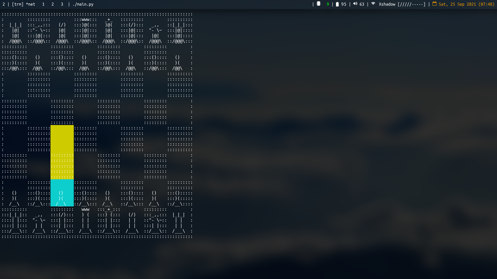
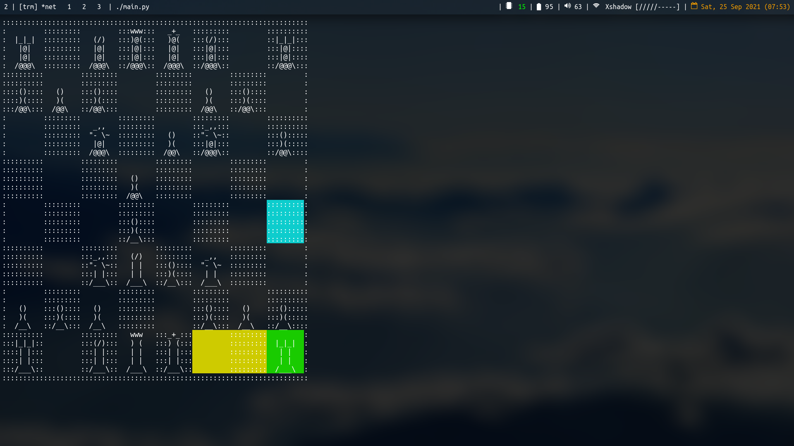

# Chess in Curses

The ASCII art used to draw the board and the chess pieces is based on [this stack overflow post](https://codegolf.stackexchange.com/questions/54869/ascii-art-chessboard). Interestingly enough the post is about a competition to make the smallest chess program, albeit quit a simple one. I didn't participate in the competition, but I liked the ASCII art and decided to use it in my project.

**How to play**

* `H` moves the cyan cursor to the left
* `L` moves the cyan cursor to the right
* `J` moves the cyan cursor down
* `K` moves the cyan cursor up
* Pressing `Space` on a piece, highlights the piece/square to green and selects that piece. Prompts for the available moves the chosen piece can play.
* Pressing `Space` on one of the yellow squares, moves the chosen piece (the one highlighted in green). To the chosen yellow square.

For the keen ones out there, you will notice these are the same keys used in VIM for navigating in normal mode.

**Things to implement**

Below are some of the things that I wish to implement in the future:

* Implement checking, you can't move any pieces that doesn't make your king safe.
* Implement safe king moving, your king cannot move to a square that is attacked. This has to be embedded into the move of every piece.
* Implement checkmating. The computer can recognise once there are no moves that can save the king.
* Implement stalemating. The game can recognise once there are no moves that can be made by the current player
* Implement pawn promotion. Once a pawn reaches the end it can be promoted to any piece, except for the king and another pawn.

**Screenshot:**

